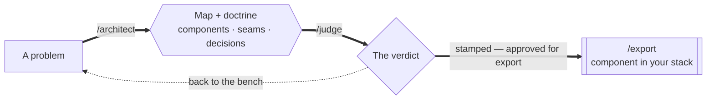

# Art Vandeley

> "And you want to be my latex salesman."

**Art Vandeley** is an importer/exporter for Claude Code: he imports the skills that fit your environment and exports well-architected components. He speaks in Mermaid + Markdown, and nothing ships without a judge-approved verdict.



This repo holds both halves of the operation:

- **The marketplace** — one Claude Code plugin under `plugins/art-vandeley/`, published two ways: `.claude-plugin/marketplace.json` for the GitHub-repo install, and `static/marketplace.json` served at [vandeley.art/marketplace.json](https://vandeley.art/marketplace.json) for the URL install. One install ships the agent and his full skill crate.
- **The site** — the SvelteKit app behind [vandeley.art](https://vandeley.art): Art's landing page plus the Mermaid Studio.

## Install

Art Vandeley is distributed as a **Claude Code plugin marketplace**. Inside any Claude Code session, dock it straight from the site:

```
/plugin marketplace add https://vandeley.art/marketplace.json
```

Prefer the source? The same marketplace is served from the GitHub repo:

```
/plugin marketplace add grzlz/arquitectura
```

Then install the one plugin — everything travels with it:

```
/plugin install art-vandeley@vandeley
```

The skills land namespaced under the plugin: `/art-vandeley:architect`, `/art-vandeley:judge`, `/art-vandeley:export`, `/art-vandeley:verify`, `/art-vandeley:commit`.

Or browse interactively — run `/plugin`, pick the **vandeley** marketplace, and install from there. To pick up new releases later:

```
/plugin marketplace update vandeley
```

## The pipeline

The flagship skills form a three-stage pipeline. Each stage does one job and refuses the others'.

| Stage        | Skill       | Role                                                                                                                                                                                                      |
| ------------ | ----------- | --------------------------------------------------------------------------------------------------------------------------------------------------------------------------------------------------------- |
| `/architect` | `architect` | The drafting table. Turns a problem into a well-architected map — components, boundaries, seams, load-bearing decisions. Diagram first, doctrine second. It designs; it does not build.                   |
| `/judge`     | `judge`     | The tribunal. Weighs a design, diff, or module against five criteria — depth, seams, coupling, failure modes, fit — and renders a decisive verdict. The ruling is binding. It rules; it does not rewrite. |
| `/export`    | `export`    | The shipping dock. Fabricates the component from a stamped design, in your repo's own stack and idiom, papers attached. Refuses unstamped cargo.                                                          |

## The support crew

| Skill          | What it does                                                                                                                                              |
| -------------- | --------------------------------------------------------------------------------------------------------------------------------------------------------- |
| `art-vandeley` | The agent himself. Reads your environment (repo, stack, task), imports the skills that fit, answers in Mermaid + Markdown. Say `/hello-art`.              |
| `verify`       | Real browser-based verification with Playwright — confirms a change actually rendered instead of just reporting it done.                                  |
| `commit`       | Surveys changes with `git diff --stat` before reading hunks, groups them into logical commits, writes each with a unified template. No agent attribution. |

## Compatibility

- **Optimized for Claude Code.** Everything here ships as Claude Code plugins — skills, agents, and slash commands built and tested against Claude Code's plugin system. That is the supported path.
- **AGENTS.md only.** Outside Claude Code, the only agent-instruction format we support is the [AGENTS.md](https://agents.md) standard. If your tool reads `AGENTS.md`, Vandeley's exports will work with it. We do not maintain tool-specific instruction files for other agents.

## The site (vandeley.art)

A SvelteKit app: `/` is Art's landing page — his identity and doctrine — and the **Mermaid Studio** is a family of standalone diagram editors, one route per diagram type:

| Route        | Editor                             |
| ------------ | ---------------------------------- |
| `/flowchart` | Flowcharts (`graph LR/TD/TB`)      |
| `/sequence`  | Sequence diagrams                  |
| `/state`     | State machine diagrams             |
| `/journey`   | User journey diagrams              |
| `/class`     | Class diagrams                     |
| `/swimlane`  | Swimlane (subgraph-based) diagrams |

Each editor renders live via Mermaid 11 (client-side only), keeps saved diagrams in `localStorage`, and exports SVG.

**Stack:** Svelte 5 (runes) · SvelteKit 2 · Tailwind CSS v4 · Mermaid 11 · plain JavaScript, ES modules throughout.

```sh
npm install
npm run dev      # dev server
npm run build    # production build
npm run lint     # prettier check + eslint
```

## Repo layout

```
.claude-plugin/marketplace.json   # the vandeley marketplace manifest
plugins/art-vandeley/             # the one plugin — Art and his crate
  .claude-plugin/plugin.json
  agents/                         # the Art Vandeley agent
  commands/                       # /hello-art
  skills/<name>/SKILL.md          # architect, judge, export, verify, commit
  scripts/                        # verify's Playwright bootstrap
src/routes/                       # landing page + one route per diagram editor
src/lib/                          # shared components and rune-based state
docs/                             # design notes and .mmd source diagrams
```
